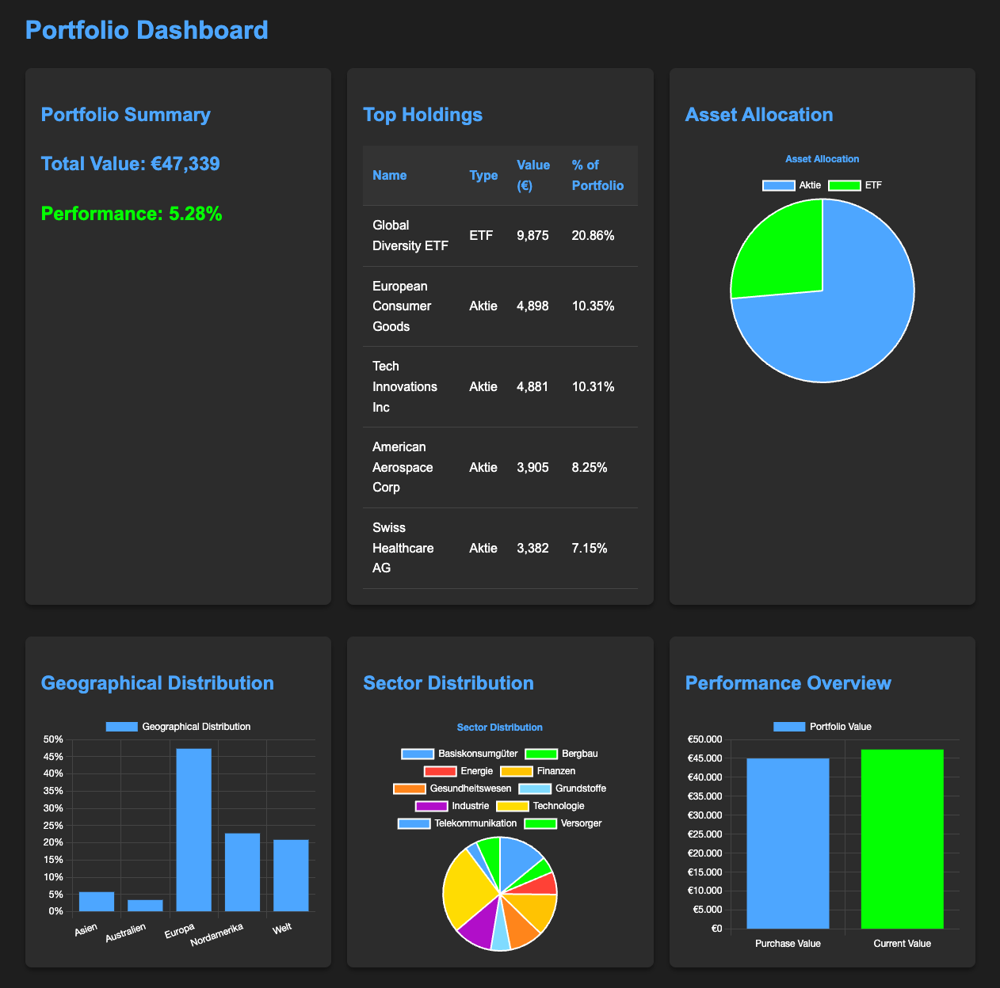
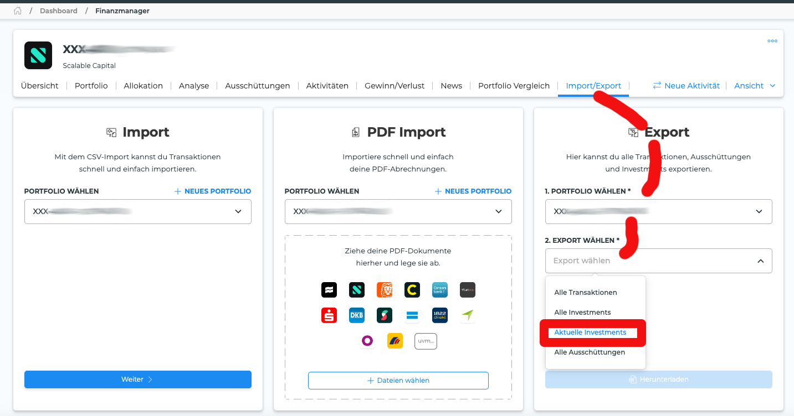

# Extra-ETF-Portfolio-Dashboard

Ein einfaches, aber leistungsfähiges Dashboard zur Visualisierung und Analyse Ihres ETF-Portfolios, basierend auf Daten von [extraETF](https://extraetf.com/de/).



## Funktionen

- Gesamtwert des Portfolios
- Performance-Übersicht
- Top-Holdings
- Asset-Allokation
- Geografische Verteilung
- Sektorverteilung
- Automatische Aktualisierung mit der neuesten CSV-Datei

## Technologien

- Backend: Flask
- Datenverarbeitung: Pandas
- Frontend-Visualisierung: Chart.js

## Installation

1. Klonen Sie das Repository:
   ```
   git clone https://github.com/mmuyakwa/Extra-ETF-Portfolio-Dashboard.git
   cd Extra-ETF-Portfolio-Dashboard
   ```

2. Erstellen Sie eine virtuelle Umgebung und aktivieren Sie sie:
   ```
   python -m venv .venv
   source .venv/bin/activate  # Für Unix oder MacOS
   .venv\Scripts\activate  # Für Windows
   ```

3. Installieren Sie die erforderlichen Pakete:
   ```
   pip install -r requirements.txt
   ```

## Verwendung

1. Exportieren Sie Ihr Portfolio von extraETF als CSV-Datei:
   

2. Speichern Sie die exportierte CSV-Datei im `data`-Ordner des Projekts.

3. Starten Sie die Anwendung:
   ```
   python app.py
   ```

4. Öffnen Sie einen Webbrowser und navigieren Sie zu `http://localhost:5000`.

## CSV-Dateiformat

Die CSV-Datei sollte folgende Spalten enthalten:

- Name: Name des Wertpapiers
- Wertpapiertyp: Typ des Wertpapiers (z.B. Aktie, Anleihe, ETF)
- Region: Geografische Region des Wertpapiers
- Sektor: Sektor des Wertpapiers
- Anzahl: Anzahl der gehaltenen Wertpapiere
- Kaufpreis: Kaufpreis pro Wertpapier
- Aktueller Wert: Aktueller Wert des Wertpapiers

## Anpassung

Sie können das Dashboard nach Ihren Bedürfnissen anpassen, indem Sie die `app.py` und `templates/index.html` Dateien bearbeiten.

## Beitrag

Beiträge sind willkommen! Bitte erstellen Sie ein Issue oder einen Pull Request für Verbesserungsvorschläge.

## Lizenz

Dieses Projekt ist unter der MIT-Lizenz lizenziert. Siehe [LICENSE](LICENSE) für Details.

## Kontakt

Für Fragen oder Unterstützung erstellen Sie bitte ein Issue im GitHub-Repository.